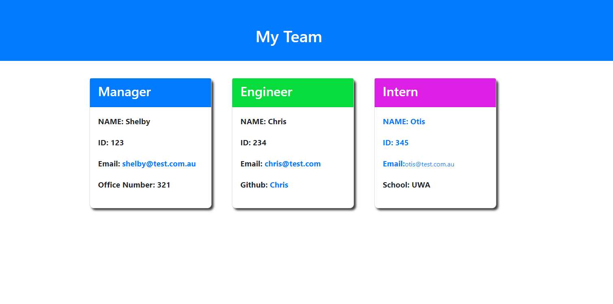

# Team Profile Generator
  
[](https://opensource.org/licenses/MIT)
  
## Description
This application has been created so that it takes input from the user about employees from the command line and generates a HTML webpage that displays a short summary for each person. To ensure that the code is maintainable, tests have been used. 

For ease of use, the email of the team members will open a new email with the TO field populated and a Github link is available for the engineers.

To create this application, the Inquirer package was used and Jest to allow for tests. JavaScript has been utilised to create the program also.

 Here is a link to a demo video with a detailed description of how to use this application: [demo video](https://youtu.be/VzmHMKuU32I)

 
 
  
## Table of Contents
- [Installation](#installation)
- [Usage](#usage)
- [License](#license)
- [Contributing](#contributing)
- [Credits](#credits)
- [Tests](#tests)
- [Questions](#questions)
  
## Installation 
To use this application, pull the code down to your preferred repository. Then make sure to install necessary dependencies by running the following command:
  ```

  npm install

  ```
  
## Usage
Once the files have been pull down to your preferred repository, run this application by inputting 'node index.js' into your bash terminal. Answer the questions when prompted.
  
## License
This project is licensed by the [MIT](https://opensource.org/licenses/MIT) license
  
## Contributing 
If this project is of interest to you, please contact me with a detailed description of how you would like to contribute prior to any pull requests.
  
## Credits
 https://www.npmjs.com/package/inquirer

 https://nodejs.org/api/fs.html

 https://www.npmjs.com/package/jest

 https://developer.mozilla.org/
  
## Tests 
 To ensure that this application is running correctly, run the following command in your bash terminal:

  ```

  npm test

  ```
  Make sure to have Jest installed so that you can set the tests to run.
  
## Questions
If you have any questions or require further clarification then please contact me at:
- https://github.com/Shelbyrp
